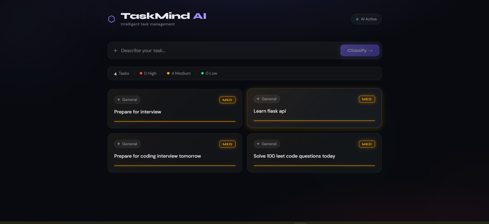

# TaskMind AI

## Overview

TaskMind AI is an AI-powered task management system that transforms unstructured natural language input into structured, actionable data. The application integrates a React frontend, Flask backend, MySQL database, and an AI model to automatically classify tasks into categories and priorities.

This project demonstrates how large language models can be applied to real-world productivity tools to reduce manual effort and improve workflow efficiency.

---

## Problem Statement

Traditional task management systems rely on manual input for categorization and prioritization. This leads to:

* Increased user effort in organizing tasks
* Inconsistent classification across users
* Reduced productivity due to lack of automation

---

## Solution

TaskMind AI solves this problem by:

* Accepting natural language task input
* Using AI to automatically classify tasks
* Generating structured metadata (category and priority)
* Storing and displaying tasks in a clean, organized interface

---

## Key Features

* AI-based task classification (category and priority)
* RESTful API for task creation and retrieval
* Structured JSON communication between components
* Persistent storage using MySQL
* Modern and responsive React UI
* Error handling and fallback logic for AI responses

---

## Tech Stack

### Frontend

* React (Functional Components, Hooks)
* JavaScript (ES6+)
* CSS (Custom styling)

### Backend

* Python
* Flask (REST API)
* Flask-CORS

### Database

* MySQL

### AI Integration

* OpenRouter API (GPT-based model)
* Prompt engineering for structured JSON output

---

## System Architecture

```
React Frontend (localhost:3000)
        ↓
Flask Backend (localhost:5000)
        ↓
AI Service (OpenRouter)
        ↓
MySQL Database
        ↓
Response back to Frontend
```

---

## Database Schema

### Table: tasks

| Column   | Type        | Description            |
| -------- | ----------- | ---------------------- |
| id       | INT (PK)    | Unique task identifier |
| title    | TEXT        | User input task        |
| category | VARCHAR(50) | AI-generated category  |
| priority | VARCHAR(20) | AI-generated priority  |
| status   | VARCHAR(20) | Task status            |

---

### Table: ai_logs

| Column     | Type      | Description              |
| ---------- | --------- | ------------------------ |
| id         | INT (PK)  | Unique log ID            |
| prompt     | TEXT      | Input sent to AI         |
| response   | TEXT      | AI response              |
| created_at | TIMESTAMP | Timestamp of interaction |

---

## API Endpoints

### Create Task

POST /tasks

**Request**

```json
{
  "title": "Prepare for coding interview"
}
```

**Response**

```json
{
  "title": "Prepare for coding interview",
  "category": "Interview Preparation",
  "priority": "High"
}
```

---

### Get Tasks

GET /tasks

**Response**

```json
[
  {
    "id": 1,
    "title": "Prepare for coding interview",
    "category": "Interview Preparation",
    "priority": "High",
    "status": "Pending"
  }
]
```

---

## Project Structure

```
TaskMind Ai/
├── backend/
│   ├── app.py
│   ├── db.py
│   ├── ai_service.py
│   ├── test_ai.py
│   ├── requirements.txt
│   └── .env
│
├── frontend/
│   ├── src/
│   │   ├── App.js
│   │   └── index.js
│   ├── package.json
│
└── README.md
```

---

## Setup Instructions

### Backend Setup

1. Navigate to backend directory:
   cd backend

2. Install dependencies:
   pip install -r requirements.txt

3. Create a `.env` file:
   OPENROUTER_API_KEY=your_api_key

4. Setup MySQL database:

   * Create database: taskmind
   * Create tables: tasks, ai_logs

5. Run backend:
   python app.py

---

### Frontend Setup

1. Navigate to frontend:
   cd frontend

2. Install dependencies:
   npm install

3. Start application:
   npm start

---

## AI Design and Prompting

The AI system is designed to convert unstructured text into structured JSON output. Prompt engineering ensures consistent formatting.

Example AI Output:

```json
{
  "category": "Interview Preparation",
  "priority": "High"
}
```

Fallback logic is implemented to handle invalid or malformed responses without breaking the system.

---

## Snapshots

### Application Interface



---

## Key Technical Decisions

* Separation of AI logic from business logic using a dedicated service layer
* Use of environment variables for secure API key management
* Structured JSON output enforcement for reliable parsing
* Modular backend design for scalability
* Minimal and responsive frontend design

---

## Limitations

* No authentication or user management
* Limited task operations (no edit/delete functionality)
* AI accuracy depends on prompt design

---

## Future Enhancements

* Add authentication and user profiles
* Implement task editing and deletion
* Add real-time updates using WebSockets
* Deploy application to cloud platforms
* Improve AI accuracy with advanced prompting

---

## Conclusion

TaskMind AI demonstrates how artificial intelligence can enhance traditional applications by automating classification and structuring unstructured input. The project reflects strong capabilities in full-stack development and practical AI integration.
